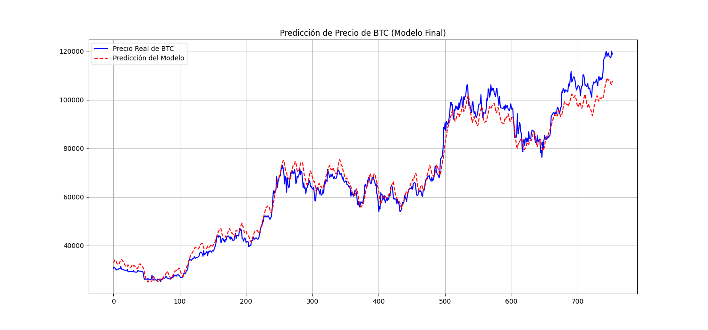

# 📈 API de Predicción de Precio de BTC con LSTM (Proyecto Final)


Este repositorio contiene un proyecto de Machine Learning de ciclo completo que desarrolla y despliega una API para predecir el precio de cierre de Bitcoin (BTC). El proyecto abarca desde la recolección de datos y la ingeniería de características hasta el entrenamiento de un modelo LSTM y su despliegue en la nube como un servicio web.

---

## 🚀 API en Vivo

La API está desplegada en Render y se puede probar a través de su documentación interactiva.

**URL de la Documentación:** **[https://btc-lstm-predictor-api-lguerman.onrender.com](https://btc-lstm-predictor-api-lguerman.onrender.com/docs)**

*(Nota: El servicio tiene un plan gratuito, por lo que la primera carga puede tardar hasta un minuto mientras el servidor "despierta").*

---

## 🧠 Resultados del Modelo Final

El modelo final es una Red Neuronal Recurrente (LSTM) entrenada para predecir el precio de cierre del día siguiente. Se utilizaron múltiples indicadores técnicos y cuantitativos como características de entrada, incluyendo RSI, MACD, Bandas de Bollinger, OBV, ATR y la diferencia de precio del día anterior.

El modelo alcanzó un rendimiento excelente en el conjunto de prueba:

*   **R² (Coeficiente de Determinación):** 0.9752
*   **RMSE (Error Cuadrático Medio):** $4,168.84
*   **MAE (Error Absoluto Medio):** $3,225.77

Un **R² de 0.96** indica que el modelo explica el 96% de la variabilidad del precio, demostrando un ajuste muy robusto a la tendencia del mercado.

**Gráfico de Predicción vs. Precio Real:**


---

## 🛠️ Arquitectura y Stack Tecnológico

*   **Pipeline de Datos:** Scripts modulares en Python para descargar, procesar, y preparar los datos, orquestados por un script maestro (`update_data.py`).
*   **Modelo:** LSTM con TensorFlow/Keras.
*   **API:** FastAPI y Uvicorn.
*   **Dependencias:** Gestionadas con `requirements.txt`.
*   **CI/CD y Alojamiento:** Git, GitHub y despliegue automático en Render.
*   **Entorno:** Python 3.10 en un entorno virtual (`venv`).

---

## 🚀 Cómo Ejecutar en Local

1.  Clonar el repositorio:
    ```bash
    git clone https://github.com/laguerman/btc-lstm-predictor-api.git
    cd btc-lstm-predictor-api
    ```
2.  Crear y activar un entorno virtual con Python 3.10.
3.  Instalar dependencias:
    ```bash
    pip install -r requirements.txt
    ```
4.  Ejecutar el pipeline de datos y entrenamiento (opcional, los artefactos ya están en el repo):
    ```bash
    python scripts/update_data.py
    python scripts/train_model.py
    ```
5.  Lanzar la API:
    ```bash
    uvicorn main:app --reload
    ```